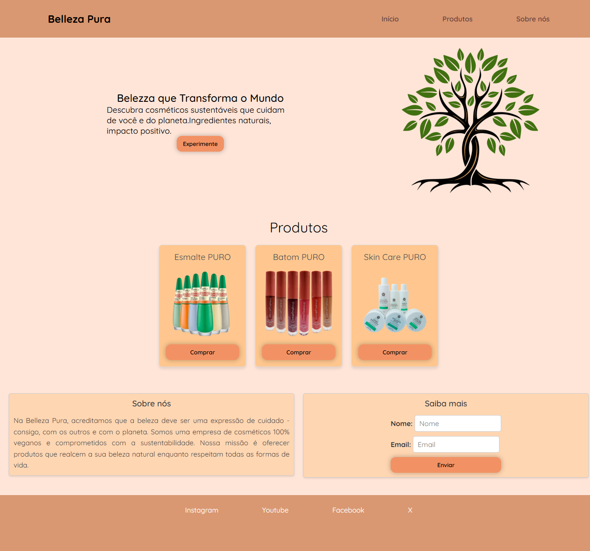

# Belleza Pura
Landing page da empresa fictícia <b>Belleza Pura</b> requisitado para o desafio de estágio da empresa Kyraly.

O repositório contempla os arquivos HTML, CSS e JS necessários para a landing page, além do design feito em Figma e um vídeo que explica as decisões tomadas ao longo da criação da página.

## Objetivo
Desenvolver uma landing page para a marca Belleza Pura, especializada em cosméticos sustentáveis. A página deve ser funcional, atraente e focada em capturar leads, destacando a nova linha de produtos veganos. 

## Preview

## Requisitos
**Estrutura HTML**

**Seções principais:**

1. Header com menu de navegação.
2. Hero com título, subtítulo e botão CTA.
3. Produtos: cards com imagem, título e botão.
4. Sobre a marca: breve descrição dos valores.
5. Formulário de captura de leads (nome e e-mail).
6. Rodapé com redes sociais e direitos autorais.

**Estilo CSS:**
- Tema clean com cores naturais (tons pastel).
- Tipografia minimalista e elegante.
- Layout responsivo para desktop e mobile.
- Efeitos simples: hover em botões e transições suaves.

**Interatividade JavaScript:**
- Validação de formulário com mensagens de erro e sucesso.
- Scroll suave ao clicar em links do menu.
- Slider/carrossel simples (opcional).
- 
## Tecnologias usadas
   